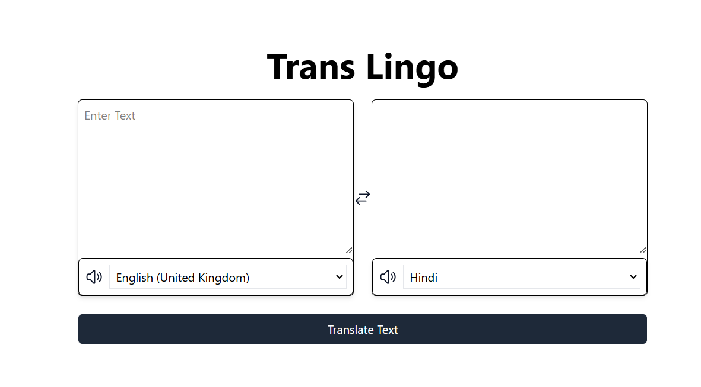
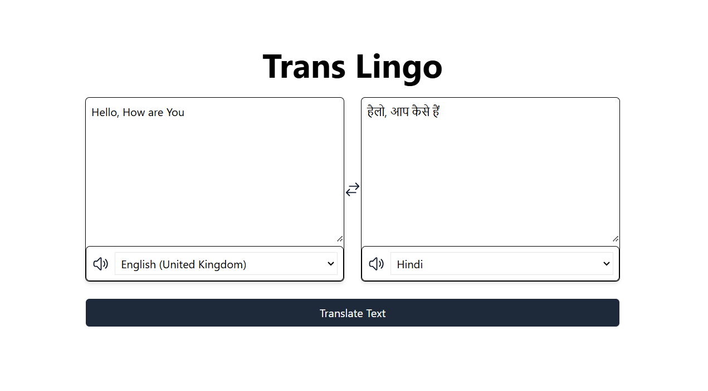
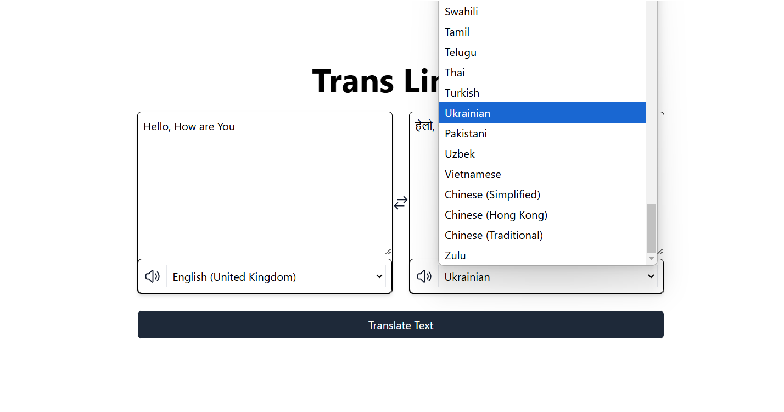
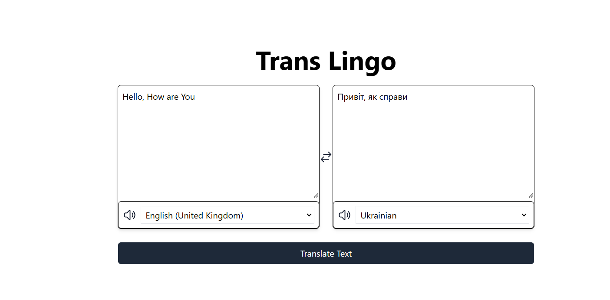

# Trans Lingo

**Trans Lingo** is a powerful and user-friendly language translation web application built with React.js and Tailwind CSS. It supports translation between all major languages and includes a text-to-speech feature for seamless communication.

---

## Features

- **Multi-Language Translation**: Translate text between numerous languages with ease.
- **Text-to-Speech**: Hear the translated text in the selected language.
- **User-Friendly Interface**: Intuitive design for effortless navigation.

---


## Screenshots

Include screenshots or GIFs here to showcase your app's UI and features.




---

## Installation

Follow these steps to run the project locally:

1. **Clone the repository**:
   ```bash
   git clone https://github.com/gautamaggarwaldev/Language_Translator.git
   ```

2. **Navigate to the project directory**:
   ```bash
   cd Language-Translator
   ```

3. **Install dependencies**:
   ```bash
   npm install
   ```

4. **Start the development server**:
   ```bash
   npm run dev
   ```

5. Open your browser and visit `http://localhost:5173` to use the app.

---

## Technologies Used

- **React.js**: Frontend framework for building user interfaces.
- **Tailwind CSS**: Utility-first CSS framework for styling.
- **Axios**: For language translation and text-to-speech functionalities.

---

## Folder Structure

```
Language-Translator/
├── public/
├── src/
│   ├── translatorComponent/
│   ├── languages/
│   ├── assets/
│   ├── App.jsx
│   ├── main.jsx
├── package.json
├── vite.config.js
└── README.md
```

---

## Contribution

Contributions are welcome! If you'd like to contribute:

1. Fork the repository.
2. Create a new branch for your feature/bug fix.
3. Commit your changes and push to the branch.
4. Open a pull request.

---

## Author

- **Your Name**  
  [GitHub] - https://github.com/gautamaggarwaldev
  [LinkedIn] - www.linkedin.com/in/gautam-aggarwal-

---

## Future Enhancements

- Add support for image-to-text translation.
- Include offline mode for translations.
- Improve text-to-speech voice quality.

